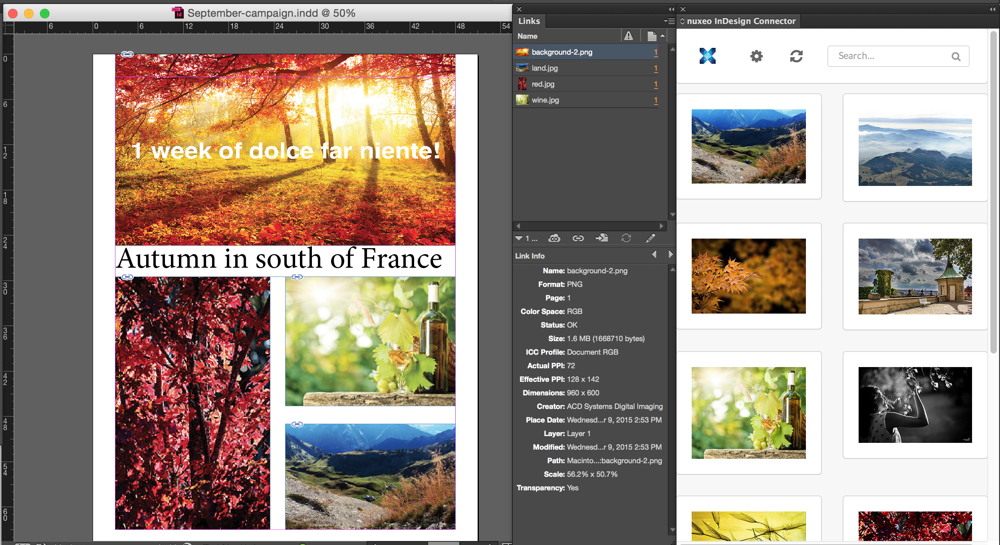

# nuxeo-indesign-connector

  
The nuxeo Connector for InDesign enables designers to import assets into an InDesign layout directly from nuxeo.
The connector is divided into 2 parts, a server side and a client side.

# Building
    mvn clean install -Pmarketplace,ftest

## QA

[](https://qa.nuxeo.org/jenkins/job/addons_nuxeo-indesign-connector-master/)

## Server side plugin

### How to install

Install [the inDesign Marketplace package](https://connect.nuxeo.com/nuxeo/site/marketplace/package/nuxeo-indesign-connector-marketplace):

    nuxeoctl mp-install marketplace-nuxeo-indesign-connector/marketplace/target/marketplace-*.zip


## Client side Plugin

### How to install

#### Step 1

Copy the folder "`nuxeo-indesign-connector-client/package/org.nuxeo.indesignconnector`":
```
On Mac, into ~/Library/Application\ Support/Adobe/CEP/extensions
```
```
On Windows, into C:\Program Files (x86)\Common Files\Adobe\CEP\extensions
```

#### Step 2

Mac OS X:

- Double click on the file **EnableUnsignedExtensions.command** that you will find under the "package/Scripts" folder.
- You will be asked to type your password, do so and press enter, that's it.

Windows:

- Double click on the file EnableUnsignedExtensions.reg under the "package/Scripts" folder and click on accept.

#### Step 3

Restart inDesign and go to **Window > Extensions > nuxeo InDesign Connector**.
Once there click on the settings icon and fill in the following informations:
- URL of your nuxeo instance
- login
- password

If everything went well you should end up having a list of assets displayed.
Once there, if you want to add an asset into your inDesign document you just need to click on the thumbnail.

## Link persistency
Now, anytime your asset is modified within nuxeo you'll get a badge notification beside the reload icon. All you need to do is click on it and the new version of the asset will be imported.
You then need to display the links panel (**Window > links**) and double click on the alert icon to replace the old version by the new one.

### Photoshop and Ilustrator 
For Photoshop and Illustrator the steps for the installation are almost the same as for InDesign.
On the server side you need to install the same marketplace package as for InDesign. 
For the client side, on Step 1 use:
- "`nuxeo-photoshop-connector-client/package/org.nuxeo.photoshopconnector`" for Photoshop
- "`nuxeo-illustrator-connector-client/package/org.nuxeo.illustratorconnector`" for Illustrator

## About Nuxeo

Nuxeo dramatically improves how content-based applications are built, managed and deployed, making customers more agile, innovative and successful. Nuxeo provides a next generation, enterprise ready platform for building traditional and cutting-edge content oriented applications. Combining a powerful application development environment with
SaaS-based tools and a modular architecture, the Nuxeo Platform and Products provide clear business value to some of the most recognizable brands including Verizon, Electronic Arts, Netflix, Sharp, FICO, the U.S. Navy, and Boeing. Nuxeo is headquartered in New York and Paris.
More information is available at [www.nuxeo.com](http://www.nuxeo.com).
